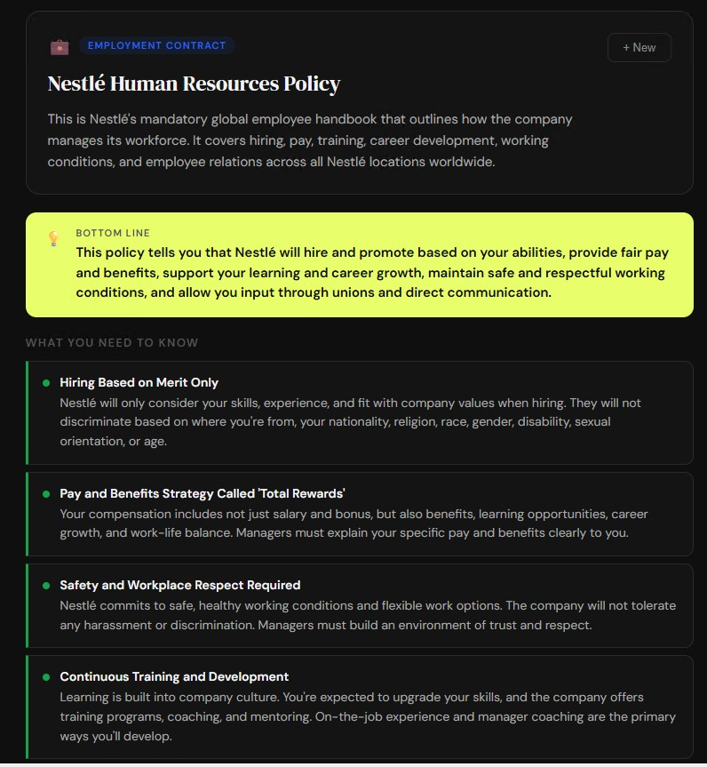
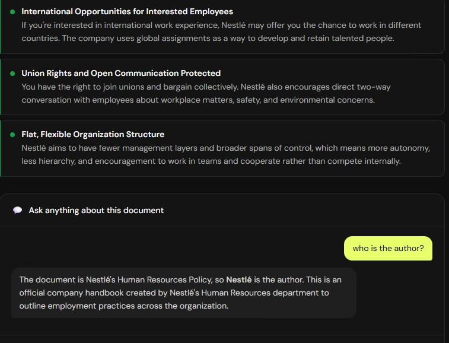

# Vernlo — Understand Any Document in Plain English

> Built during Hackathon — March 2026


## What it does
Upload any confusing document and get plain English instantly.

- 📄 Upload any PDF or text document (lease, employment contract, medical report, insurance policy, loan agreement)
- 🤖 AI reads and analyzes it automatically using Claude API
- 💡 Get: plain English summary, key points with severity flags, red flags, and a bottom line
- 💬 Ask follow-up questions about your specific document

## Screenshots

### Upload Screen


### Analysis Results



## Tech Stack
- **Frontend:** React
- **Backend:** Node.js + Express (proxy server)
- **AI:** Claude API (claude-haiku-4-5-20251001) — document analysis + chat

## Setup

### 1. Install dependencies
```bash
npm install
```

### 2. Set up environment variables
Create a `.env` file in the root folder:
```
REACT_APP_ANTHROPIC_KEY=your_claude_api_key_here
```

### 3. Start the backend (Terminal 1)
```bash
node server.js
```
Backend runs on port 3001.

### 4. Start the frontend (Terminal 2)
```bash
npm start
```
Frontend runs on port 3000.

## Supported Document Types
- 🏠 Lease agreements
- 💼 Employment contracts
- 🩺 Medical reports / lab results
- 🛡️ Insurance policies
- 🏦 Loan agreements
- ⚖️ Any legal document

## Known Issues
- Large PDFs (5MB+) may hit API rate limits — recommended test file size under 2MB
- DOC/DOCX format support limited — PDF and TXT work best

## Phase 2 (Coming Soon)
- Supabase auth (Google login)
- Save document history
- Folder organization
- Share analysis with others

## Hackathon Notes
Built for Simplilearn/Purdue Hackathon — March 2026.

Also built [JobFit AI](https://github.com/tshetennsherpa-sudo/jobfit-ai) during the same hackathon — an AI-powered resume and job match analyzer deployed on Streamlit Cloud.

**Problem:** People sign documents they don't understand.
**Solution:** AI reads it, you get plain English in seconds.

## Contact
**Tsheten Sherpa**
- LinkedIn: [Tsheten Sherpa](https://www.linkedin.com/in/tsheten-sherpa-79228b2a4)
- GitHub: [tshetennsherpa-sudo](https://github.com/tshetennsherpa-sudo)
